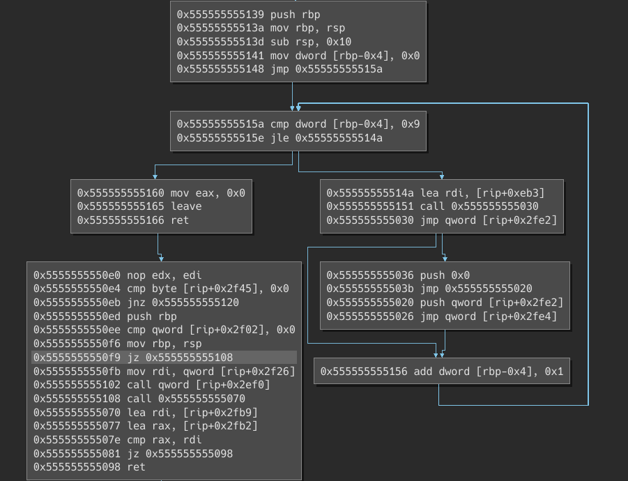

Personnal binary ninja scripts

* highlight and hitcount
Highlight a list of addresses from a file in the following format
```
0x400000|everything after a '|' is ignored
0x400001
0x400002
```
Can also displays instruction level hitcount, and create basic blocks where
binary ninja did not discover them.

* Create a control flow graph from execution traces in the following format
```
0x400000|xor %rax, %rax
0x400002|ret
```
Only uses binary ninja to render the CFG. Performs execution trace merging.



* create functions from a function pointer array

